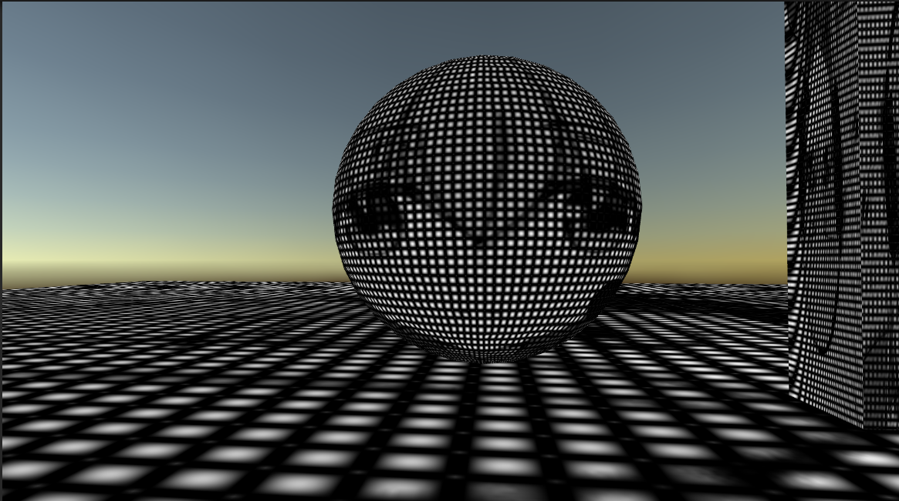
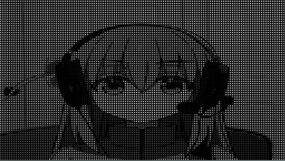
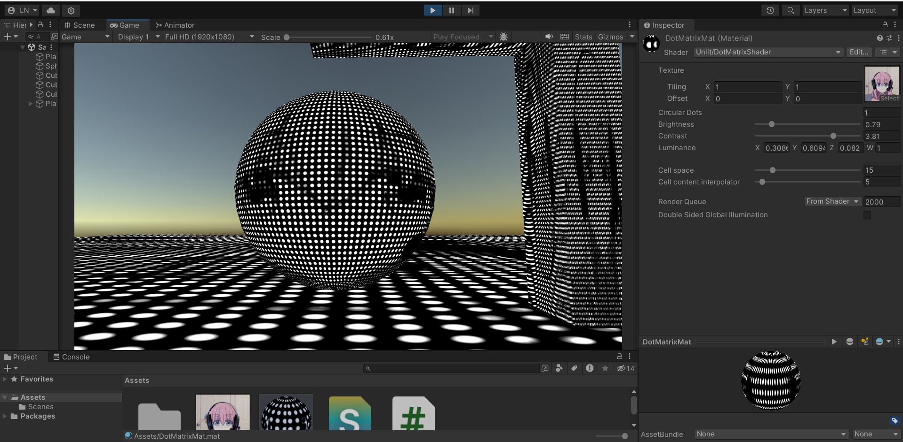
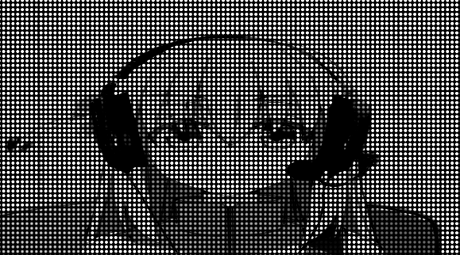

# Playing with dot matrix!

&emsp;I know it's an unusual way to begin describing the project, but oh god was this painful. Don't get me wrong, I used a simple logic to make a simple effect, but 3D. Three dimensions. That was the reason of my downfall. 

&emsp;I'm still learning the best practices to apply those effects the way I want and it's been somewhat difficult, but I think I'm handling it nicely. I've heard about the Unity's rendering pipeline and the modifications one can do to it, so I intend to work with that in the next project I develop. The problem is that I had never worked with 3D before this and I discovered that rendering gets different depending on the distance between the camera and the object being rendered... Now I'm thinking that I should've expected it, but I'm glad I faced this issue so early in the journey, because I was able to learn a lot from it.

&emsp;Well, getting to the point now, I've developed a simple dot matrix effect with a bit of a grayscale attached to it (just for fun, I wanted to see how I could do it). It was pretty fun, but I insisted on doing it on 3D and the distortion that comes with the distance from the camera when rendering things annoyed me so much. I spent most of my time trying to fix it and it was frustrating, because I couldn't. However, the effect is not bad at all, and it works smoothly in 2D, so I decided to share it here and start fresh on a new subject so I could apply some new (and hopefully better) practices to my shader implementations and see if I can solve the problems I encountered so far.

&emsp;Before I show you any results, here's the image I used as the base sprite:

&emsp;And here's some footage of how it's looking on 3D and on 2D with the effect:

&emsp;I even added the option to make the "dots" circles instead of squares. Looks like this:

&emsp;And that's how far I've come with this project. I have just one more demo, but it's quite nauseating. I encountered a way of making the effect close to what I wanted, without distortion, but the dots on the dot matrix kinda move with the camera, so every step you take gives you a bit of a headache. Check it out:

&emsp;I'll look for a way to make that last "solution" viable, because I would really like it if it worked properly. It moves too much though. I'll also look for a way to record better gifs, I've just realized that they are in a very bad resolution.

&emsp;Wrapping it up now, to achieve that effect I basically define the space that a cell (or a dot) will occupy in the grid (or the matrix) and also the size of that cell content. As this parameters work in mysterious ways when the space is smaller or very similar to the size (and on some other situations...), I decided to call the "cell size" parameter as "cell content interpolator". It's probably wrong, but in my head it interpolates the content of the cell between some values, so it makes more sense than "cell size". Then, I generate and color cells for each pixel according to the previous parameters by calculating where each dot should be and how big it is.

