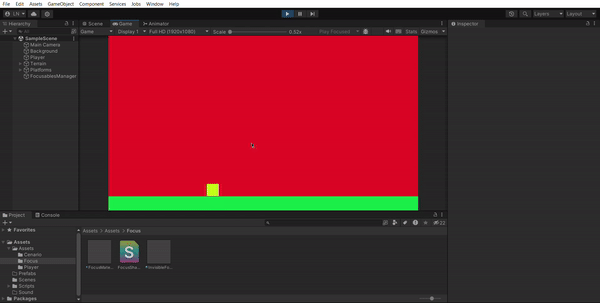
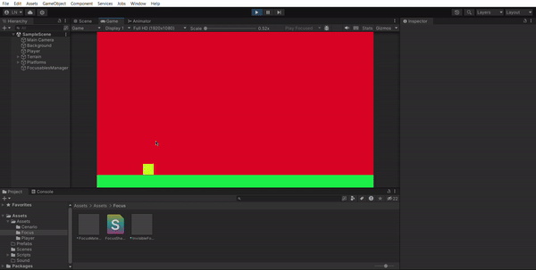

# Playing with outline!

&emsp;This short project is inspired by an idea that me and some friends had about a game where the player controlled a dead man who didn't accept his death and consequently found himself in a limbo between the real world an the spiritual world. The whole game would revolve around alternating the character's vision so the player would see the spiritual world when he pressed a key on the keyboard, then being able to see structures he couldn't before, but that would stop the player's movement, so he would have to memorize the structures and the position of the elements in the scenario in order to move around and complete some puzzles. I'll show a prototype of that mechanic in the gif below.

&emsp;As you can see, it's a pretty simple effect. The pixelated black and white look is not only easier to implement, but it's also the aesthetic I was kinda looking for or at least imagining for the game, since the character would close his eyes and focus to "see beyond his senses", or something like that. Nonetheless, I am proud of the work I've done with this effect! It was pretty fun and I learned a lot.

&emsp;I also made a "second version" of the effect but with a smaller radius, the idea was providing the player the hability to "focus" while moving around, but with some "debuff" (which is the smaller radius). Turned out pretty fun to use, maybe I'll turn this into something cool in a future project. And here's the footage of that:

&emsp;The proccess of making this effect was very interesting. I started by trying to define intervals on the UV where the outline should be rendered, and it worked well, until I tested with a sprite that wasn't a square. I laughed so hard because the whole time I was just programming a square outline and didn't even realize it. The placeholder sprites really messed my head up by giving me hope that I was in the right path.

&emsp;Then I had to discover a way of making it work for any shape, and defining intervals on the UV wasn't gonna work. So I learned about the magical wonders of having two different passes! Turns out I could write a pass to scale the vertex coordinates up and render the outline color, then write another pass just to render the original sprite in its original scale. And there I had it, an outline shader! Pretty neat and simple.

